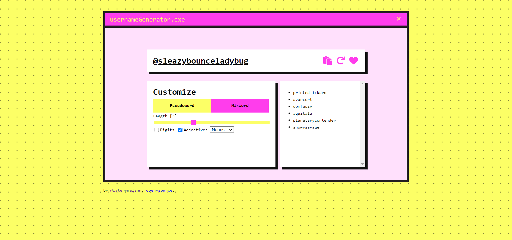

# Username Generator [Work In Progress]

  

## [Demo](https://waterrmalann.github.io/username-generator/)   |   [Source](https://github.com/waterrmalann/username-generator/blob/main/src/js/main.js)

A fully client-side username generator web app that can generate unique monikers. There is a pseudoword generator that can randomly generate pronouncable usernames and a mixword generator that combines randomly picked words from predefined wordlists in adjective + noun order. This project was written in HTML, SCSS, and vanilla JavaScript with a few dependencies.

This project borrows word dictionaries from [unique-names-generator](https://github.com/andreasonny83/unique-names-generator), [unique-username-generator](https://github.com/subhamg/unique-username-generator), and [moniker](https://github.com/weaver/moniker).

#### Dependencies

- [gpw](https://multicians.org/thvv/gpw-js.html) (*Pronouncable passwords generator repurposed to generate usernames.*)



---

### 🚀 Setup

A live version and up to date version of the web app is available [here](https://waterrmalann.github.io/username-generator/). If you wish to modify the app or host it yourself, you can clone the repo and do whatever you want with it.

1. [Clone the repository](https://docs.github.com/en/github/creating-cloning-and-archiving-repositories/cloning-a-repository-from-github/cloning-a-repository).

```sh
git clone https://github.com/waterrmalann/username-generator.git
```

2. Install the dependencies.

```sh
npm install
```

3. This will start a live server. Head to the IP shown in the console.

```sh
npm run start
```

---

### 🤝 Contribution

Contributions are always accepted. Feel free to open a pull request to fix any issues or to make improvements you think that should be made. Any contribution will be accepted as long as it doesn't stray too far from the objective of the app. If you're in doubt about whether the PR would be accepted or not, you can always open an issue to get my opinion on it.

License
----

This project is licensed under the permissive **MIT License**, see [LICENSE](LICENSE)
